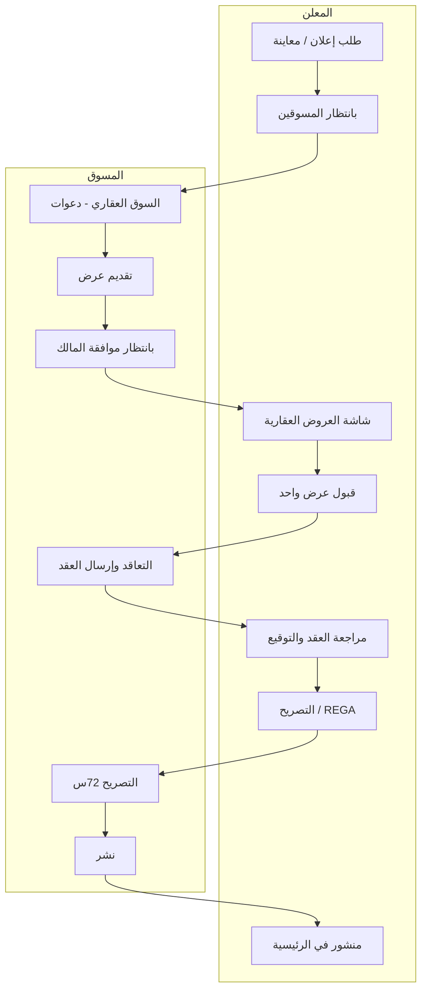

# مواصفة مسار التسويق الكاملة — نقاط المنتج (مترابطة)

> **الغرض:** حفظ كل ما طُلب لمسار «طلب إعلان → سوق المسوّقين → عروض → تعاقد → تصريح REGA → نشر» دون نسيان عنصر، مع بيان **الحالة التقنية الحالية** في المستودع و**الربط** بين المراحل.  
> **تحديث:** وثيقة حية — عند إكمال بند في الكود أو SQL حدّث عمود الحالة.

---

## دليل الحالات

| رمز | المعنى |
|-----|--------|
| ✅ | منفّذ وظيفياً في التطبيق/الخادم (مع اختبار يدوي موصى به) |
| 🔶 | منفّذ جزئياً أو يعتمد على بيانات/ترحيل Supabase |
| ☐ | غير منفّذ أو يحتاج تذكرة منفصلة |

---

## 1) التسمية والتبويبات في «صفحتي»

| # | المطلوب | الحالة | الربط / المراجع |
|---|---------|--------|-------------------|
| 1.1 | استبدال مسمى تبويب «الدعوات» للمسوّق بـ **السوق العقاري** | ✅ | `lib/l10n/app_*.arb` → `marketerTabInvites` |
| 1.2 | تبويبات المسوّق والمالك تعمل؛ التنقل بينها يعمل | 🔶 | `user_dashboard.my_ads_hub.dart`، تحكم `TabController` |
| 1.3 | شارة/تلميح لوحة التحكم (نقطة حمراء) عند وجود عناصر في المسار | ✅ | `navMyDeskPipelineBadgeTooltip`؛ المسوّق: `_marketerPipelineNavBadgeCount`؛ المعلن: `_ownerPipelineNavBadgeCount` (تبويبا 0+1) في `user_dashboard.ui.dart` |

**الربط:** تغيير المسمى لا يغيّر المنطق — مصدر الصفوف ما زال `_mkInvites` وقوائم التسويق من `user_dashboard.marketing_loaders.dart`.

---

## 2) المعلن / المستخدم الفرد — من طلب إعلان حتى مراجعة المسوّقين

| # | المطلوب | الحالة | الربط |
|---|---------|--------|--------|
| 2.1 | إنشاء طلب إعلان/معاينة (`listing_requests`) | ✅ | `create_listing_request` / شاشات الإضافة |
| 2.2 | في تبويب **بانتظار المسوقين** لا تظهر أزرار «مسوّق» تحت بطاقة إعلان المعلن (المعلن ليس مسوّقاً) | 🔶 | مراجعة واجهة `_MarketRequestListingStyleCard` / بطاقات المالك في `my_ads_hub` |
| 2.3 | زر **العروض العقارية** تحت البطاقة يفتح شاشة فيها كل عروض المسوّقين | ✅ | `OwnerOffersPage` + `_openOwnerOffersForRequest` |
| 2.4 | بطاقات العروض: معلومات مقدّم العرض، تقييم، تاريخ/وقت، أيقونات مرتبة | 🔶 | `owner_offers_page.dart` — التقييم موجود جزئياً عبر `ChatPeerService.fetchRatingSummariesForUserIds` |
| 2.5 | تحت كل عرض: **موافقة** أو **رفض**؛ عند الموافقة لعرض واحد تختفي موافقة الباقين | 🔶 | `owner_select_offer` + واجهة المالك؛ يحتاج اختبار حالات متعددة |
| 2.6 | زر **اعتذار** يفتح منبثق لسبب الاعتذار (اختياري)؛ يختفي العرض من قائمة المعلن ويُسجَّل للمسوّق | 🔶 | `owner_decline_listing_offer` + `decline_kind=apology` + `OwnerOffersPage` |
| 2.7 | بعد اعتذار المعلن يعود الطلب/الفرصة للمسوّق في **السوق العقاري** (جولة/سياسة خادم) | 🔶 | SQL `20260418120000_*` وحدود الرفض — راجع سياسة الجولات |

---

## 3) المسوّق — تبويب «السوق العقاري» (الدعوات سابقاً)

| # | المطلوب | الحالة | الربط |
|---|---------|--------|--------|
| 3.1 | البطاقة **بنفس أسلوب الرئيسية** (شبكة وقائمة): صورة + معلومات مماثلة | 🔶 | `_buildMarketerRowCard` + دمج صفوف؛ ليس بالضرورة نفس `PropertyListingCard` في كل الحالات |
| 3.2 | زرّان تحت كل بطاقة: **تفاصيل الإعلان العقاري** و **تقديم عرض** | ✅ | `_buildMarketerInviteActionsGrid` عند `marketerInvitesTabLayout` |
| 3.3 | الضغط على البطاقة/الصورة يفتح تفاصيل كالرئيسية | 🔶 | `_openMarketingPreviewProperty` → `PropertyDetailsPage` مع `allowMarketingOffer` للدعوة |
| 3.4 | **تقديم عرض** يفتح منبثقاً: صورة العقار، ملخص بحقول وأيقونات، أتعاب محسوبة، حقل ملاحظات **تعليمي**، زر إرسال | 🔶 | `MarketingOfferSubmitPanel` — يحتوي صورة علوية و`helperText` تعليمي؛ التطابق مع وصف «كل أيقونة» يبقى تحسيناً بصرياً |
| 3.5 | بعد الإرسال يُشعر المالك (`notifyOwnerNewMarketingOffer`) ويُحدَّث دلو المسوّق (`MarketingWorkflowHub`) | ✅ | `marketing_offer_submit_sheet.dart` + `marketing_flow_service.dart` |
| 3.6 | يختفي الطلب من «السوق العقاري» **للمسوّق الذي قدّم العرض** ويظهر في **بانتظار موافقة المالك** | 🔶 | فلترة `invitesVisible` + عروض في `_mkOffers` — يعتمد `listing_offers` وحالة الطلب |

---

## 4) تفاصيل الإعلان (شاشة عامة) — أزرار ذكية للمسوّق

| # | المطلوب | الحالة | الربط |
|---|---------|--------|--------|
| 4.1 | أزرار تقديم عرض من تفاصيل الإعلان **لا تظهر في الرئيسية** بعد النشر | 🔶 | `PropertyDetailsPage` + `allowMarketingOffer` + حالة الإعلان |
| 4.2 | لا تظهر إذا سبق تقديم عرض في الجولة | 🔶 | `marketerHasLiveOfferForRequestRound` في `MarketingFlowService` |
| 4.3 | اختصارات مسار المسوّق (`marketerHubPhase`) عند الفتح من لوحة التسويق | 🔶 | تمرير من `_openMarketingPreviewProperty` |

---

## 5) التعاقد — إرسال العقد، موافقة المالك، PDF

| # | المطلوب | الحالة | الربط |
|---|---------|--------|--------|
| 5.1 | بعد قبول المالك يظهر للمسوّق مسار **التعاقد** (إنشاء عقد، محادثة) | 🔶 | `listing_contracts`، `ListingContractChatPage`، `_createMarketingContract` |
| 5.2 | إرسال العقد للمالك مع تأكيد استخدام التوقيع الإلكتروني من الملف الشخصي | 🔶 | RPCs `send_listing_contract_to_owner`، نصوص التأكيد في الواجهة |
| 5.3 | للمالك: فتح العقد كاملاً، **قبول** مع تأكيد توقيع؛ ثم PDF | 🔶 | `ownerSignListingContract`، `ContractPdfService` / روابط PDF |
| 5.4 | في مرحلة الموافقة: **دردشة** أو **طلب إلغاء عقد** بأزرار تظهر/تختفي حسب الحالة | ☐ / 🔶 | يحتاج مواءمة دقيقة مع `listing_contracts.status` |

---

## 6) التصريح 72 ساعة — REGA وفال — النشر

| # | المطلوب | الحالة | الربط |
|---|---------|--------|--------|
| 6.1 | بعد التوقيع: انتقال الطلب لتبويب **التصريح** للطرفين مع **عدّاد 72 ساعة** | 🔶 | `permits_due_at`، `ListingWorkflowProgressStrip`، بطاقات التصريح في `my_ads_hub` |
| 6.2 | أيقونة PDF للعقد على البطاقة | 🔶 | `contract_pdf_url` في الصفوف المدمجة |
| 6.3 | للمسوّق: ربط رقم التصريح + مطابقة فال + **نشر** عند الصحة | 🔶 | `_linkRegaAdLicenseWithAuthority`، `SubmitPermitsPage`، نشر من RPC |
| 6.4 | عدم المطابقة بعد 2–3 محاولات → فسخ العقد تلقائياً + نص قانوني | 🔶 | `report_rega_license_mismatch` + سياسات SQL — راجع الترحيلات |

---

## 7) النشر والمنشور

| # | المطلوب | الحالة | الربط |
|---|---------|--------|--------|
| 7.1 | بعد نجاح التصريح والنشر يظهر الإعلان في **الرئيسية للجميع** | 🔶 | `publish_property_from_contract` / مراحل `workflow_stage` |
| 7.2 | انتقال البطاقة لتبويب **منشور** للمسوّق وللمعلن | 🔶 | تبويب `_mkPublished` وفلترة المراحل |

---

## 8) الإشعارات والأصوات

| # | المطلوب | الحالة | الربط |
|---|---------|--------|--------|
| 8.1 | إشعارات داخل التطبيق لكل مرحلة (عرض، قبول، عقد، تصريح، نشر) | 🔶 | `in_app_notifications`، `workflow_create_notification`، `InAppNotificationRouter` |
| 8.2 | نغمات/أنماط عالمية لكل تبويب على الجهاز | ☐ | يحتاج FCM/إعدادات منصّة وربط `workflow_toast_sound` أو ما يعادله |

---

## 9) خريطة التدفق (مترابطة)

---

## 10) ملفات كود رئيسية (للمطورين)

| منطقة | ملفات |
|--------|--------|
| تحميل دلو المسوّق | `lib/screens/user_dashboard.marketing_loaders.dart` |
| واجهة تبويبات المسوّق/المالك | `lib/screens/user_dashboard.my_ads_hub.dart` |
| منبثق العرض | `lib/widgets/marketing_offer_submit_sheet.dart` |
| تفاصيل الإعلان | `lib/screens/property_details_page.dart` |
| عروض المالك | `lib/screens/owner_offers_page.dart` |
| خدمة المسار | `lib/services/marketing_flow_service.dart` |
| إشعارات وتوجيه | `lib/core/notifications/in_app_notification_catalog.dart`، `lib/services/in_app_notification_router.dart` |
| دليل المسار للمستخدم | `lib/widgets/marketing_full_scenario_sheet.dart` |
| SQL مرجعي | `supabase/sql/20260418120000_workflow_apology_rega_mismatch_chain.sql` وغيره |

---

## 11) ماذا تفعل عند إضافة ميزة جديدة

1. حدّث **رقم البند** أعلاه والحالة (✅/🔶/☐).  
2. أضف اختباراً يدوياً في `docs/MARKETING_WORKFLOW_AR.md` إن لزم.  
3. حدّث مصفوفة الإشعارات `lib/core/notifications/workflow_notification_matrix.dart` إن أضفت حدثاً جديداً.

---

*هذه الوثيقة هي المرجع الوحيد لـ «كل ما طُلب» في مسار التسويق؛ أي تنفيذ جزئي في الكود يجب أن يُسجَّل هنا لتجنب الضياع.*
