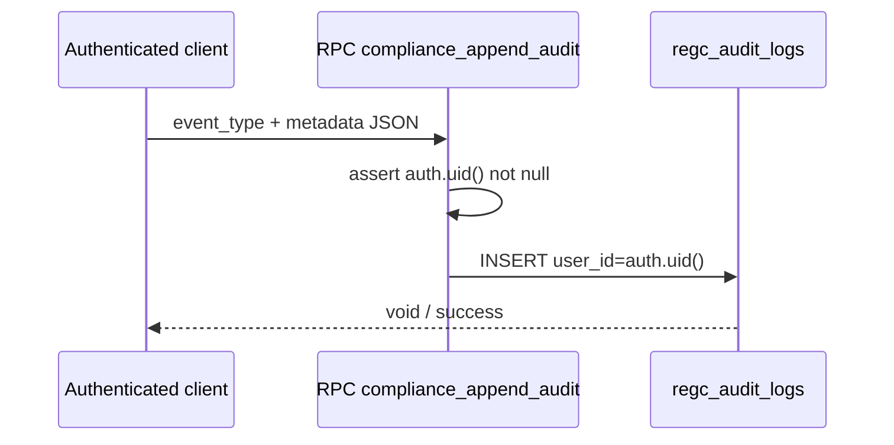

# Audit logging flow

## Integrity

- Direct `INSERT` on `regc_audit_logs` is **not** granted to `authenticated`; only RPC path.

## Evidence

- `docs/regulatory_evidence/AUDIT_LOGGING_EVIDENCE.md`  
- `supabase/sql/staging_validation/validate_audit_logs.sql`
