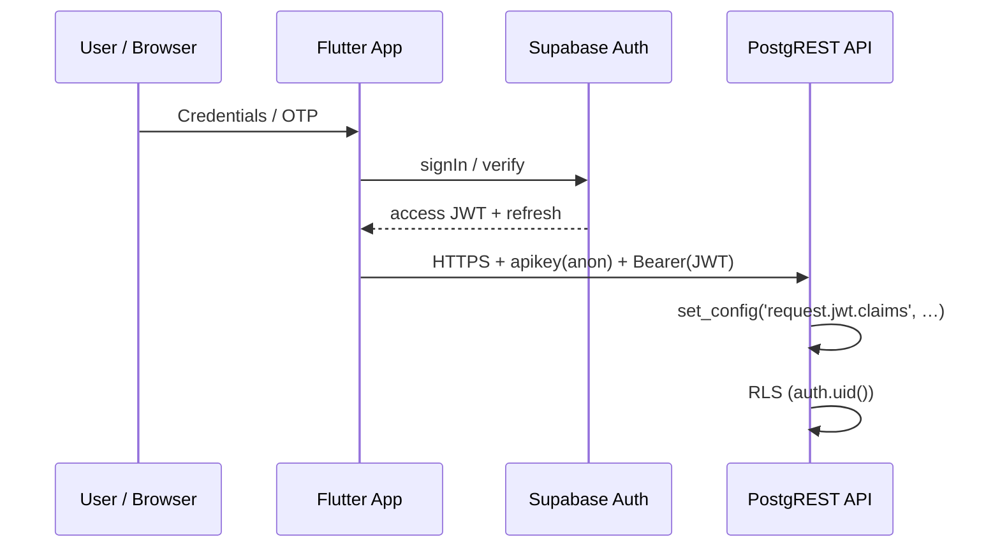

# Authentication flow (high level)

## Notes

- **Never** ship `service_role` in `A`.  
- Web: consider idle timeout (`web_session_ttl` pattern).

## Evidence

- `docs/regulatory_evidence/JWT_VALIDATION_EVIDENCE.md`  
- `supabase/sql/staging_validation/validate_jwt_claims.sql`
