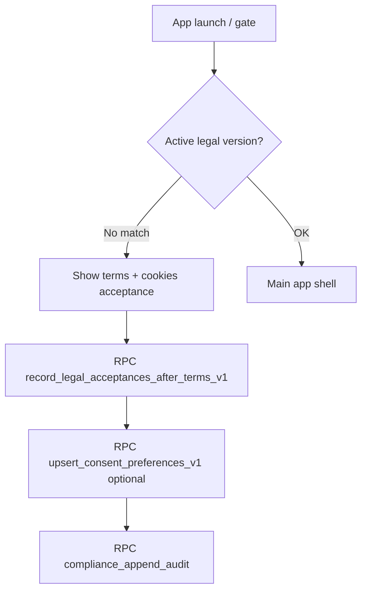

# Compliance flow (legal + consent)

## Tables

- `regc_legal_policy_documents` — versioned text.  
- `regc_user_legal_acceptances` — per-user pointer to `policy_id`.  
- `regc_consent_preferences` — analytics / marketing flags.

## Evidence

- `docs/regulatory_evidence/CONSENT_TRACKING_EVIDENCE.md`  
- `docs/regulatory_evidence/POLICY_VERSIONING_EVIDENCE.md`
