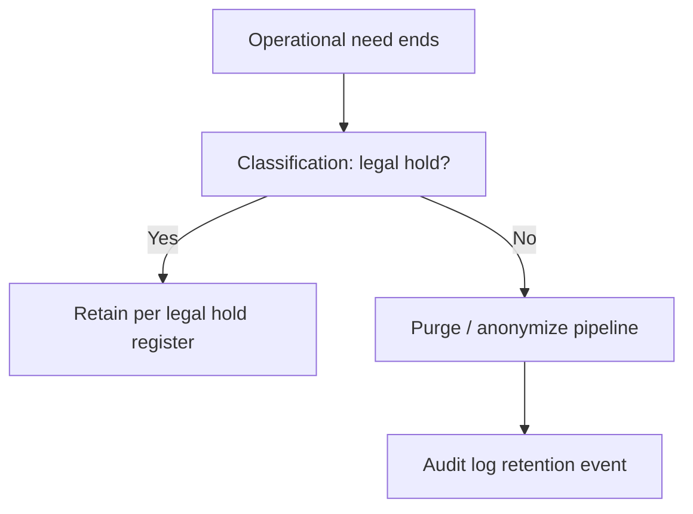

# Data retention flow (conceptual)

## Repository alignment

- Narrative: `docs/compliance/DATA_RETENTION.md`.  
- Technical deletion: implement via controlled RPC or service_role jobs (**not** exposed to anon).

## Evidence

- `docs/REGULATORY_GAP_ANALYSIS.md` (non-software steps)
