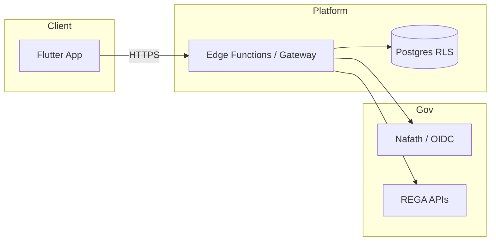

# Government integration flow (target state)

## Current vs target

- **Today:** public URLs + documentation; demo flag for isolated stacks.  
- **Target:** signed webhooks, mTLS or IP allow lists per REGA program.

## Evidence

- `docs/government_submission/`  
- `docs/regulatory_evidence/GOVERNMENT_DEMO_EVIDENCE.md`
