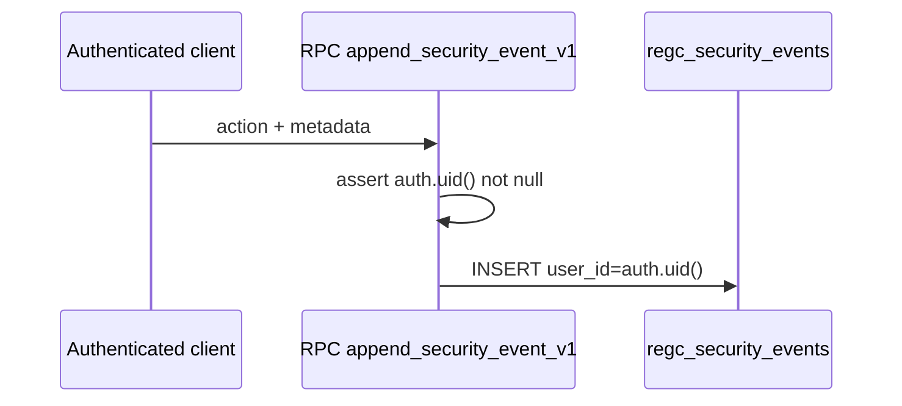

# Security event flow

## Difference from audit

- **Security events:** security-relevant signals (can feed SIEM export).  
- **Audit logs:** broader compliance trail (`compliance_append_audit`).

## Evidence

- `docs/regulatory_evidence/SESSION_SECURITY_EVIDENCE.md`  
- `supabase/sql/staging_validation/validate_security_events.sql`
