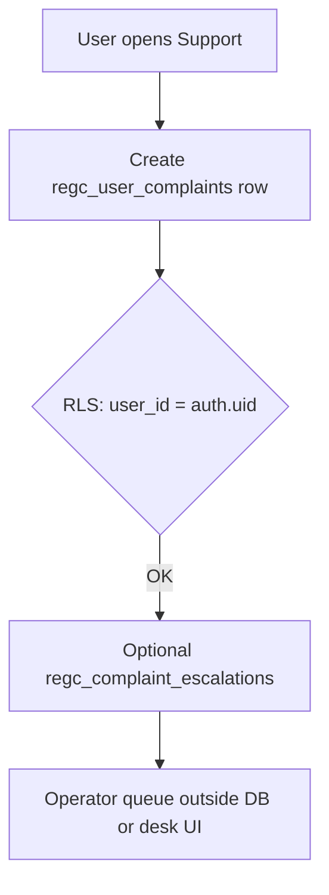

# Support & complaint escalation flow

## Isolation

- User **A** cannot `SELECT` complaints for user **B** (policy enforced).

## Evidence

- `docs/regulatory_evidence/COMPLAINT_ESCALATION_EVIDENCE.md`  
- `supabase/sql/staging_validation/validate_ticket_isolation.sql`
