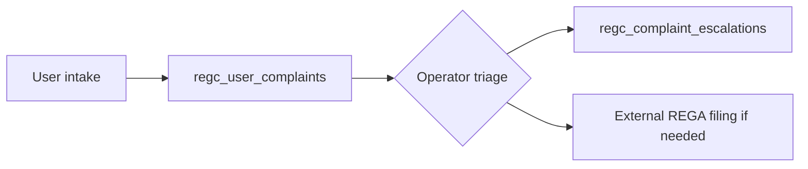

# Complaint Escalation Flow

## Intake

1. User: Settings → Support → **Log in-app complaint** (subject + body).  
2. System: `INSERT INTO regc_user_complaints` + audit `complaint.submitted`.  
3. Optional: user emails `COMPLIANCE_COMPLAINTS_EMAIL` for formal channel.

## Triage (operator — manual until ticketing module exists)

| Priority | Indicators | First response target (example) |
|----------|------------|----------------------------------|
| P1 | Fraud, safety, minors | < 4 business hours |
| P2 | Regulatory / REGA | < 1 business day |
| P3 | General dispute | < 2 business days |

## Escalation record

```sql
INSERT INTO public.regc_complaint_escalations (complaint_id, escalated_to, notes)
VALUES ('<complaint_uuid>', 'legal_counsel', 'Escalated for REGA notification draft');
```

RLS: only the complaint owner may insert escalation rows for their `complaint_id` (user-driven escalation request). **Internal** escalations by staff should use a **separate admin path** (service_role or future `staff` role) — document as gap if staff must update without user action.

## Closure

- Set `status` on complaint (requires future `UPDATE` policy for staff or RPC).

## Diagram (logical)


