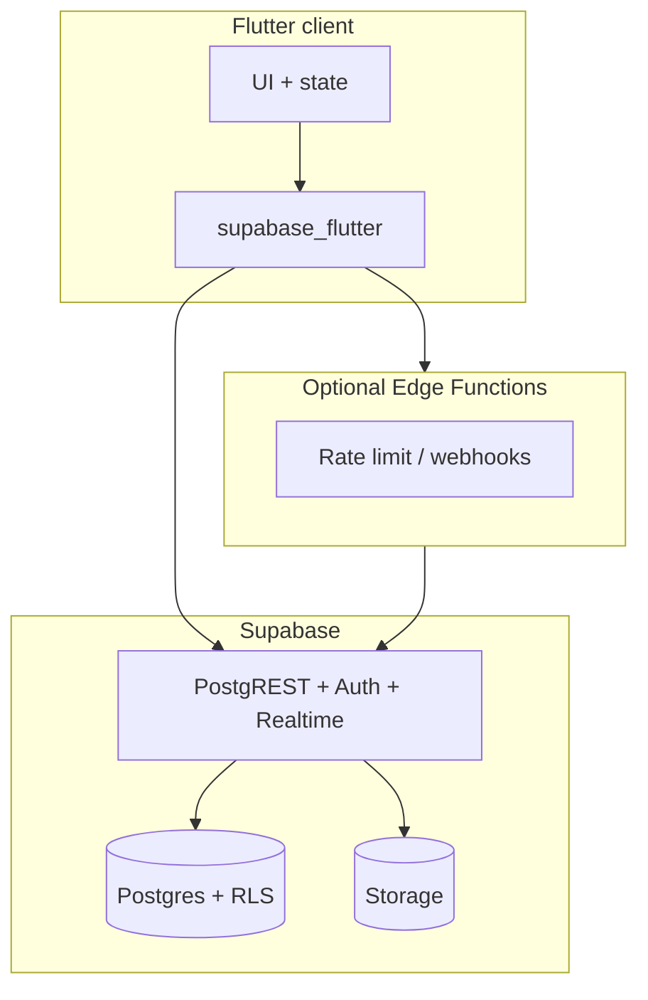

# Security architecture (summary)

## Controls

- **Auth:** Supabase Auth JWT.  
- **AuthZ:** RLS on `public` tables; `SECURITY DEFINER` RPCs for controlled writes (`compliance_append_audit`, …).  
- **Compliance data:** `regc_*` namespace to avoid legacy table collisions.  
- **Web session hardening:** idle logout + tab binding (see codebase `web_session_ttl`, `WebAuthTabGuard`).

## Out of scope in client

- WAF, bot management, DDoS — **edge network** responsibility.
